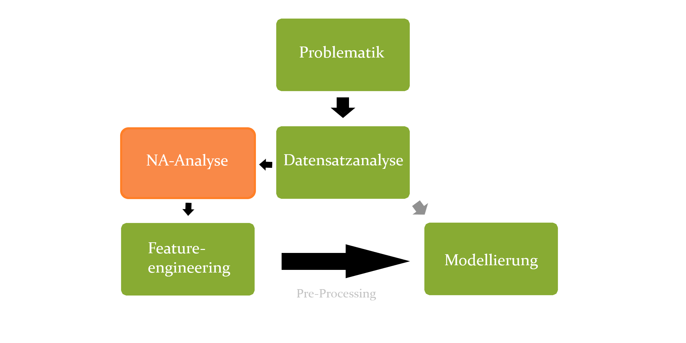

```{r setup, eval = FALSE, include = FALSE}
library(flexdashboard)
library(magrittr)
library(dplyr)
library(caret)
library(purrr)
library(ggplot2)
library(stringr)
library(parallel)
library(doParallel)
library(Deriv)
library(pROC)
library(caTools)
library(glmnet)
library(knitr)
library(kableExtra)
library(rmarkdown)

knitr::opts_chunk$set(echo = FALSE)
knitr::opts_chunk$set(warning = FALSE)
data_trucks_training <- read.csv("aps_failure_training_set.csv", sep = ",", skip = 20, na.strings = "na")
data_trucks_test <- read.csv("aps_failure_test_set.csv", sep = ",", skip = 20, na.strings = "na")
```

Problematik
=======================================================================

Column {data-width=1}
-----------------------------------------------------------------------

### Problemstellung {data-height=700}
Der Scania-Trucks Datensatz kommt mit 171 anonymisierten Featuren sowie 76000 Observationen, welche im Verhältnis 60.000 zu 16.000 in Trainings- bzw. Testdaten aufgeteilt sind. Jede Observation enthält die Information, ob ein Fehler im Luftdruckssystem ( im Folgenden <b>LDS</b> genannt ) vorliegt oder nicht. <br>
<center>Die Problemstellung lautet:</center> <br>
<div class = "bordered"><i>
Sage für jede Observation im Testdatensatz voraus, ob ein Fehler im LDS vorliegt oder nicht. Minimiere dabei folgende Kostenfunktion: <br>
<b>$cost(FP, FN) = 10 \cdot FP + 500 \cdot FN$</b> <br>
Es handelt sich hierbei also um ein <b>Klassifizierungsproblem</b>, mit der Kostenfunktion $cost(FP, FN)$ als Metrik. <br>
</i></div> <br>
<b><u>Fehler 1. Art (FP):</u></b> <br>
Der Fehler 1. Art, hier <b>F</b>alse <b>P</b>ositive, bedeutet, dass man einer Observation einen Fehler im LDS zuschreibt, obwohl das Fahrzeug fehlerfrei ist. Man schickt das Fahrzeug also in die Werkstatt, obwohl kein Fehler vorhanden ist. <br><br>
<b><u>Fehler 2. Art (FN):</u></b> <br>
Der Fehler 2. Art, hier <b>F</b>alse <b>N</b>egative, bedeutet, dass man eine Observation als fehlerfrei einstuft, obwohl das Fahrezeug einen Fehler im LDS aufweist. <br><br>
<div class = "bordered"><i>
Der Fehler 1. Art ist logischerweise deutlich kostengünstiger gewichtet als der Fehler 2. Art. Es ist wesentlich günstiger einen LKW fälschlicherweise in die Werkstatt zur Überprüfung zu schicken, als dass ein LKW, bedingt durch einen LDS-Fehler, auf der Strecke liegen bleibt.
</i></div> <br><br>

### Hintergrund {data-height=300}
Das Scania-Trucks Problem wurde auf der <b>IDA 2016</b> vorgestellt. Die IDA ist ein internationaels Symposium über intelligente Datenanylse, welche 2016 im Kontext des <b>maschinellen Lernens</b> das Industrieproblem für die Öffentlichkeit zugänglich gemacht hat. Scania, Mitsponsor der IDA, hat auf die beiden kostengünstigstens Modelle einen Preis von 500$ aussgeschrieben, sowie einen Rednerspot auf der IDA selbst. <br><br>

<div id = "bordered> </div>

Column {data-width=3}
----------------------------------------------------------------------

### Vorgehensweise 
<center>
<div id = "bordered> </div>
<br><br><br><br><br><br>
<div id = "bordered> </div>
</center>


Datensatz {data-orientation=rows}
===============================================

Row {data-height=200}
-----------------------------------------------

### Histogramm-Feature
Aus der Beschreibung des Scnaia-Trucks Problems lässt sich herauslesen, dass gewisse Feature Histogrammdaten abbilden. 
Das heißt, dass ein Feature auf mehrere Container aufgeteilt ist, wobei der Wert im Container $A_i$ die Aufenthaltsdauer in der Klasse $A$ bedeutet, wobei $A$ das obergeordnete Feature ist. <br>
Beispielverteilung des Features <b>ag</b>:

```{r table-hist-ag}
kable(data_trucks_training[1:8, str_detect(colnames(data_trucks_training), "ag_00+") == TRUE], "html", caption = "Histogrammdaten") %>%
  kable_styling("striped", position = "left" )
```

Row {data-height=300 .tabset .tabset-fade}
-----------------------------------------------

### Feature <b>ag</b>

```{r mean-hist-ag}
ag_labels <- paste0("ag_00", 0:9)
ag_mean <- sapply(data_trucks_training[, str_detect(colnames(data_trucks_training), "ag_00+") == TRUE], function(x) mean(x, na.rm = TRUE)) %>% as.numeric()
ag_mean_df <- data.frame(labels = ag_labels, mean = ag_mean)
```


<div style = "display: inline-block; width: 45vw; margin-top: 4vh;">
```{r plot-ag, out.width = "95%", fig.height = 3}
ggplot(ag_mean_df, aes(x = labels, y = mean)) +
  geom_bar(stat = "identity", fill = "#88ab33") +
  theme_minimal() +
  ggtitle("Verteilung des Mittelwertes")
```
</div>

<div style = "display: inline-block; width: 45vw; margin-top: 4vh; margin-left: 5vw;">
```{r plot-ag-log, out.width = "95%", fig.height = 3}
ggplot(ag_mean_df, aes(x = labels, y = mean)) +
  geom_bar(stat = "identity", fill = "#88ab33") +
  scale_y_continuous(trans = "log10") +
  theme_minimal() +
  ggtitle("Verteilung von log(Mittelwert)")
```
</div>

### Feature <b>ay</b>

```{r mean-hist-ay}
ay_labels <- paste0("ay_00", 0:9)
ay_mean <- sapply(data_trucks_training[, str_detect(colnames(data_trucks_training), "ay_00+") == TRUE], function(x) mean(x, na.rm = TRUE)) %>% as.numeric()
ay_mean_df <- data.frame(labels = ay_labels, mean = ay_mean)
```


<div style = "display: inline-block;, width: 45vw; margin-top: 4vh;">
```{r plot-ay, out.width = "95%", fig.height = 3}
ggplot(ay_mean_df, aes(x = labels, y = mean)) +
  geom_bar(stat = "identity", fill = "#88ab33") +
  theme_minimal() +
  ggtitle("Verteilung des Mittelwertes")
```
</div>

<div style = "display: inline-block; width: 45vw; margin-top: 4vh; margin-left: 5vw;">
```{r plot-ay-log, out.width = "95%", fig.height = 3}
ggplot(ay_mean_df, aes(x = labels, y = mean)) +
  geom_bar(stat = "identity", fill = "#88ab33") +
  scale_y_continuous(trans = "log10") +
  theme_minimal() +
  ggtitle("Verteilung von log(Mittelwert)")
```
</div>

### Feature <b>az</b>

```{r mean-hist-az}
az_labels <- paste0("az_00", 0:9)
az_mean <- sapply(data_trucks_training[, str_detect(colnames(data_trucks_training), "az_00+") == TRUE], function(x) mean(x, na.rm = TRUE)) %>% as.numeric()
az_mean_df <- data.frame(labels = az_labels, mean = az_mean)
```


<div style = "display: inline-block; width: 45vw; margin-top: 4vh;">
```{r plot-az, out.width = "95%", fig.height = 3}
ggplot(az_mean_df, aes(x = labels, y = mean)) +
  geom_bar(stat = "identity", fill = "#88ab33") +
  theme_minimal() +
  ggtitle("Verteilung des Mittelwertes")
```
</div>

<div style = "display: inline-block; width: 45vw; margin-top: 4vh; margin-left: 5vw;">
```{r plot-az-log, out.width = "95%", fig.height = 3}
ggplot(az_mean_df, aes(x = labels, y = mean)) +
  geom_bar(stat = "identity", fill = "#88ab33") +
  scale_y_continuous(trans = "log10") +
  theme_minimal() +
  ggtitle("Verteilung von log(Mittelwert)")
```
</div>

### Feature <b>ba</b>

```{r mean-hist-ba}
ba_labels <- paste0("ba_00", 0:9)
ba_mean <- sapply(data_trucks_training[, str_detect(colnames(data_trucks_training), "ba_00+") == TRUE], function(x) mean(x, na.rm = TRUE)) %>% as.numeric()
ba_mean_df <- data.frame(labels = ba_labels, mean = ba_mean)
```


<div style = "display: inline-block; width: 45vw; margin-top: 4vh;">
```{r plot-ba, out.width = "95%", fig.height = 3}
ggplot(ba_mean_df, aes(x = labels, y = mean)) +
  geom_bar(stat = "identity", fill = "#88ab33") +
  theme_minimal() +
  ggtitle("Verteilung des Mittelwertes")
```
</div>

<div style = "display: inline-block; width: 45vw; margin-top: 4vh; margin-left: 5vw;">
```{r plot-ba-log, out.width = "95%", fig.height = 3}
ggplot(ba_mean_df, aes(x = labels, y = mean)) +
  geom_bar(stat = "identity", fill = "#88ab33") +
  scale_y_continuous(trans = "log10") +
  theme_minimal() +
  ggtitle("Verteilung von log(Mittelwert)")
```
</div>

### Feature <b>cn</b>

```{r mean-hist-cn}
cn_labels <- paste0("cn_00", 0:9)
cn_mean <- sapply(data_trucks_training[, str_detect(colnames(data_trucks_training), "cn_00+") == TRUE], function(x) mean(x, na.rm = TRUE)) %>% as.numeric()
cn_mean_df <- data.frame(labels = cn_labels, mean = cn_mean)
```


<div style = "display: inline-block; width: 45vw; margin-top: 4vh;">
```{r plot-cn, out.width = "95%", fig.height = 3}
ggplot(cn_mean_df, aes(x = labels, y = mean)) +
  geom_bar(stat = "identity", fill = "#88ab33") +
  theme_minimal() +
  ggtitle("Verteilung des Mittelwertes")
```
</div>

<div style = "display: inline-block; width: 45vw; margin-top: 4vh; margin-left: 5vw;">
```{r plot-cn-log, out.width = "95%", fig.height = 3}
ggplot(cn_mean_df, aes(x = labels, y = mean)) +
  geom_bar(stat = "identity", fill = "#88ab33") +
  scale_y_continuous(trans = "log10") +
  theme_minimal() +
  ggtitle("Verteilung von log(Mittelwert)")
```
</div>

### Feature <b>cs</b>

```{r mean-hist-cs}
cs_labels <- paste0("cs_00", 0:9)
cs_mean <- sapply(data_trucks_training[, str_detect(colnames(data_trucks_training), "cs_00+") == TRUE], function(x) mean(x, na.rm = TRUE)) %>% as.numeric()
cs_mean_df <- data.frame(labels = cs_labels, mean = cs_mean)
```


<div style = "display: inline-block; width: 45vw; margin-top: 4vh;">
```{r plot-cs, out.width = "95%", fig.height = 3}
ggplot(cs_mean_df, aes(x = labels, y = mean)) +
  geom_bar(stat = "identity", fill = "#88ab33") +
  theme_minimal() +
  ggtitle("Verteilung des Mittelwertes")
```
</div>

<div style = "display: inline-block; width: 45vw; margin-top: 4vh; margin-left: 5vw;">
```{r plot-cs-log, out.width = "95%", fig.height = 3}
ggplot(cs_mean_df, aes(x = labels, y = mean)) +
  geom_bar(stat = "identity", fill = "#88ab33") +
  scale_y_continuous(trans = "log10") +
  theme_minimal() +
  ggtitle("Verteilung von log(Mittelwert)")
```
</div>

### Feature <b>ee</b>

```{r mean-hist-ee}
ee_labels <- paste0("ee_00", 0:9)
ee_mean <- sapply(data_trucks_training[, str_detect(colnames(data_trucks_training), "ee_00+") == TRUE], function(x) mean(x, na.rm = TRUE)) %>% as.numeric()
ee_mean_df <- data.frame(labels = ee_labels, mean = ee_mean)
```


<div style = "display: inline-block; width: 45vw; margin-top: 4vh;">
```{r plot-ee, out.width = "95%", fig.height = 3}
ggplot(ee_mean_df, aes(x = labels, y = mean)) +
  geom_bar(stat = "identity", fill = "#88ab33") +
  theme_minimal() +
  ggtitle("Verteilung des Mittelwertes")
```
</div>

<div style = "display: inline-block; width: 45vw; margin-top: 4vh; margin-left: 5vw;">
```{r plot-ee-log, out.width = "95%", fig.height = 3}
ggplot(ee_mean_df, aes(x = labels, y = mean)) +
  geom_bar(stat = "identity", fill = "#88ab33") +
  scale_y_continuous(trans = "log10") +
  theme_minimal() +
  ggtitle("Verteilung von log(Mittelwert)")
```
</div>

Feature-Engineering
=========================================

Column {data-width=100}
-----------------------------------------

### <b>NA-Analyse</b>


Column {data-width=100}
-----------------------------------------

### <b>Datenaufbereitung</b>
<center>
Der Scania-Trucks Datensatz weist eine hohe Zahl an fehlenden Werten ( hier im Folgenden <b>NA's</b> genannt) auf. Dies kann insbesondere beim modellieren zu Problemen führen, da fehlende Werte für den <b>Klassifizierungsalgorithmus</b> unmöglich zu handlen sind.
Eine Möglichkeit besteht darin, eine gewisse Anzahl an NA's zuzulassen und demnach die Anzahl der Feature anhand dieser Grenze zu reduzieren. <br>
Alle Observationen, welche nach der <b>Featurereduktion</b> noch NA's enthalten, werden entfernt. <br>
Folgende Tabelle liefert einen Überblick über die NA Grenzen:
</center> <br>

```{r NA-Tabelle, eval = FALSE}
data_trucks <- rbind(data_trucks_training, data_trucks_test)

na_df <- data.frame(Var = colnames(data_trucks), 
                    Na = sapply(data_trucks, function(x) sum(is.na(x))))

na_breaks <- na_df$Na %>% unique() %>% sort()

result_NA <- data_frame(na_number = na_breaks, vars = numeric(length = length(na_breaks)),
                        obs = numeric(length = length(na_breaks)),
                        obs_pos = numeric(length(na_breaks)))

for (i in na_breaks){
  
  select_columns <- 
    which(na_df$Na <= i) %>% 
    as.numeric()
  
  sub_trucks <- data_trucks[ , select_columns] %>% na.omit()
  
  n_obs <- nrow(sub_trucks)
  n_vars <- ncol(sub_trucks)
  n_obs_pos <- sub_trucks[sub_trucks$class == "pos", ] %>% count() %>% as.numeric()
  
  result_NA$vars[result_NA$na_number == i] = n_vars
  result_NA$obs[result_NA$na_number == i] = n_obs
  result_NA$obs_pos[result_NA$na_number == i] = n_obs_pos
}

result_NA <- result_NA %>%
  mutate(vars_percent = (vars / ncol(data_trucks)) * 100, 
         obs_percent = (obs / nrow(data_trucks)) * 100,
         obs_pos_percent = (obs_pos / nrow(data_trucks[data_trucks$class == "pos", ])) * 100)
```

<br>

```{r NA-Tabelle-Kable}
kable(result_NA, "html", caption = "NA Grenzen, Featureanzahl ( Blau ), allgemeiner Obsservationsverlust ( Grün ) & fehlerhafter Observationsverslut ( Rot )") %>%
  kable_styling("striped") %>%
  column_spec(c(2,5), background = "lightblue") %>%
  column_spec(c(3,6), background = "lightgreen") %>%
  column_spec(c(4,7), background = "#ff4c4c") 
```

<br>

<center>
```{r NA-Plot}
ggplot(result_NA) + 
  geom_point(aes(na_number, vars_percent), colour = "blue") +
  geom_point(aes(na_number, obs_percent), colour = "green") +
  geom_point(aes(na_number, obs_pos_percent), colour = "red") +
  xlab("Number of NA's") + ylab("") +
  scale_y_continuous(limits = c(1, 100)) 
```
</center>

<br>

<div class = "bordered">
<center><b>Featuregewinnung:</b></center> <br>
Aus der Tabelle lässt sich erkennen, dass bei den unterschiedlichen NA-Grenzen die Anzahl an gewonnener Feature stark schwankt. So gewinnt man beim Sprung von 0 auf 195 NA's lediglich 1 Feature dazu, beim Sprung von 861 auf 863 Feature aber direkt 30 Feature. Das NA verhalten ist also alles andere als proportional. Die Entscheidung, welche NA-Grenze man als Auschlussverfahren nimmt, hängt aber nicht nur von der Featuregewinnung ab.
</div> <br>
<div class = "bordered">
<center><b>Allgemeiner Observationsverlust:</b></center> <br>
Alle Feature im späteren Modell zu berücksichten bringt nichts, wenn man nur noch auf 5% der ursprünglichen Daten trainieren kann. Deshalb spielt der <b>Observationsverlust</b> eine starke Rolle in der Entscheidung. Hier zeichnet sich ein starker Sprung von 5598 auf 12012 NA's ab. Evaluiert man also die Grenzen anhand des Observationsverlustes, sollte man nicht über die Grenze von 5598 hinaus gehen, da direkt danach c.a. 10% der LKW's zusätzlich verloren gehen. 
</div> <br>
Normalerweise wären dass bereits ausreichende Informationen, um eine fundierte Meinung über die Wahl der NA-Grenze zu treffen. Der Scania-Trucks Datensatz weist allerdings ein noch größeres Problem auf. Von den 76000 Observationen sind lediglich <b>1375</b> fehlerhaft. Dadurch könnte es passieren, dass wir bei der Wahl der NA-Grenze alle fehlerhaften Observationen verlieren. <br>
Demnach muss zusätzlich folgende Variable mit einkalkuliert werden: <br><br>
<div class = "bordered">
<center><b>Fehlerhafter Observationsverlust:</b></center> <br>
Der fehlerhafte Oberservationsverlust beschreibt die Anzahl der Observationen die bei der Wahl der NA-Grenze verloren gehen und zusätzlich einen Fehler im LDS aufweisen. Anhand der geringen Fehlerrate im Datensatz wäre es fatal, zu viele der fehlerhaften Fahrzeuge zu verlieren, da ein Modell so möglicherweise auf ausschließlich fehlerfreien Daten trainieren könnte. Die Grenze für fehlerhafte Observationen findet sich in der Tabelle offensichtlich beim Sprung von 928 NA's auf 3188 NA's. Obwohl man hier nur 1 Feature dazu gewinnen würde, fallen 30% der fehlerhaften Observationen dadurch raus. Die Grenze ist demnach also bei 928 NA's zu setzen.
</div> </br>


Column {data-width=100}
-----------------------------------------

### <b>Pre-Processing</b>


NA-Analyse
===============================================

Column {data-width=400}
-----------------------------------------------
<center>
Der Scania-Trucks Datensatz weist eine hohe Zahl an fehlenden Werten ( hier im Folgenden <b>NA's</b> genannt) auf. Dies kann insbesondere beim modellieren zu Problemen führen, da fehlende Werte für den <b>Klassifizierungsalgorithmus</b> unmöglich zu handlen sind.
Eine Möglichkeit besteht darin, eine gewisse Anzahl an NA's zuzulassen und demnach die Anzahl der Feature anhand dieser Grenze zu reduzieren. <br>
Alle Observationen, welche nach der <b>Featurereduktion</b> noch NA's enthalten, werden entfernt. <br>
Folgende Tabelle liefert einen Überblick über die NA Grenzen:
</center> <br>

```{r NA-Tabelle, eval = FALSE}
data_trucks <- rbind(data_trucks_training, data_trucks_test)

na_df <- data.frame(Var = colnames(data_trucks), 
                    Na = sapply(data_trucks, function(x) sum(is.na(x))))

na_breaks <- na_df$Na %>% unique() %>% sort()

result_NA <- data_frame(na_number = na_breaks, vars = numeric(length = length(na_breaks)),
                        obs = numeric(length = length(na_breaks)),
                        obs_pos = numeric(length(na_breaks)))

for (i in na_breaks){
  
  select_columns <- 
    which(na_df$Na <= i) %>% 
    as.numeric()
  
  sub_trucks <- data_trucks[ , select_columns] %>% na.omit()
  
  n_obs <- nrow(sub_trucks)
  n_vars <- ncol(sub_trucks)
  n_obs_pos <- sub_trucks[sub_trucks$class == "pos", ] %>% count() %>% as.numeric()
  
  result_NA$vars[result_NA$na_number == i] = n_vars
  result_NA$obs[result_NA$na_number == i] = n_obs
  result_NA$obs_pos[result_NA$na_number == i] = n_obs_pos
}

result_NA <- result_NA %>%
  mutate(vars_percent = (vars / ncol(data_trucks)) * 100, 
         obs_percent = (obs / nrow(data_trucks)) * 100,
         obs_pos_percent = (obs_pos / nrow(data_trucks[data_trucks$class == "pos", ])) * 100)
```

### NA-Tabelle

```{r NA-Tabelle-Kable}
kable(result_NA, "html", caption = "NA Grenzen, Featureanzahl ( Blau ), allgemeiner Obsservationsverlust ( Grün ) & fehlerhafter Observationsverslut ( Rot )") %>%
  kable_styling("striped") %>%
  column_spec(c(2,5), background = "lightblue") %>%
  column_spec(c(3,6), background = "lightgreen") %>%
  column_spec(c(4,7), background = "#ff4c4c") 
```

<br>

### NA Plot ( Feature ( Blau ) & Observationen ( Grün ) & fehlerhafte Observationen ( Rot ) in % )

<center>
```{r NA-Plot}
ggplot(result_NA) + 
  geom_point(aes(na_number, vars_percent), colour = "blue") +
  geom_point(aes(na_number, obs_percent), colour = "green") +
  geom_point(aes(na_number, obs_pos_percent), colour = "red") +
  xlab("Number of NA's") + ylab("") +
  scale_y_continuous(limits = c(1, 100)) 
```
</center>

Column {data-width=400}
----------------------------------------
### <b>Tabellenevaluation</b>
<div class = "bordered">
<center><b>Featuregewinnung:</b></center> <br>
Aus der Tabelle lässt sich erkennen, dass bei den unterschiedlichen NA-Grenzen die Anzahl an gewonnener Feature stark schwankt. So gewinnt man beim Sprung von 0 auf 195 NA's lediglich 1 Feature dazu, beim Sprung von 861 auf 863 Feature aber direkt 30 Feature. Das NA verhalten ist also alles andere als proportional. Die Entscheidung, welche NA-Grenze man als Auschlussverfahren nimmt, hängt aber nicht nur von der Featuregewinnung ab.
</div> <br>
<div class = "bordered">
<center><b>Allgemeiner Observationsverlust:</b></center> <br>
Alle Feature im späteren Modell zu berücksichten bringt nichts, wenn man nur noch auf 5% der ursprünglichen Daten trainieren kann. Deshalb spielt der <b>Observationsverlust</b> eine starke Rolle in der Entscheidung. Hier zeichnet sich ein starker Sprung von 5598 auf 12012 NA's ab. Evaluiert man also die Grenzen anhand des Observationsverlustes, sollte man nicht über die Grenze von 5598 hinaus gehen, da direkt danach c.a. 10% der LKW's zusätzlich verloren gehen. 
</div> <br>
Normalerweise wären dass bereits ausreichende Informationen, um eine fundierte Meinung über die Wahl der NA-Grenze zu treffen. Der Scania-Trucks Datensatz weist allerdings ein noch größeres Problem auf. Von den 76000 Observationen sind lediglich <b>1375</b> fehlerhaft. Dadurch könnte es passieren, dass wir bei der Wahl der NA-Grenze alle fehlerhaften Observationen verlieren. <br>
Demnach muss zusätzlich folgende Variable mit einkalkuliert werden: <br><br>
<div class = "bordered">
<center><b>Fehlerhafter Observationsverlust:</b></center> <br>
Der fehlerhafte Oberservationsverlust beschreibt die Anzahl der Observationen die bei der Wahl der NA-Grenze verloren gehen und zusätzlich einen Fehler im LDS aufweisen. Anhand der geringen Fehlerrate im Datensatz wäre es fatal, zu viele der fehlerhaften Fahrzeuge zu verlieren, da ein Modell so möglicherweise auf ausschließlich fehlerfreien Daten trainieren könnte. Die Grenze für fehlerhafte Observationen findet sich in der Tabelle offensichtlich beim Sprung von 928 NA's auf 3188 NA's. Obwohl man hier nur 1 Feature dazu gewinnen würde, fallen 30% der fehlerhaften Observationen dadurch raus. Die Grenze ist demnach also bei 928 NA's zu setzen.
</div> </br>
<center><b><u>Fazit:</u></b></center>
<center>
Die NA-Analyse zeigt, dass verschiedene Breakpoints existieren, um eine gewisse Anzahl von Featuren zu erhalten / nicht zu viele Observationen zu verlieren. <br>
Um auf dem kompletten Trainingsset vorhersagen treffen zu können, müssen die fehlenden Werte aber aufgefüllt werden, anstatt <b>NA-Reduktion</b> zu betreiben. <br>
Hierzu stehen Möglichkeiten wie <b>knn-imputation</b> oder <b>median-imputation</b> zur Verfügung. Im Folgenden werden diese Möglichkeiten evaluiert.
</center>

Feature-Engineering 1 - Datenaufbereitung {data-orientation=rows}
=========================================

Row {data-height=200}
-----------------------------------------

### Problematik
<center>
Die <b>Datensatzanalyse</b> hat gezeigt, dass viele der Histogrammdaten nicht gleichmäßig ( normal- ) verteilt sind.
Oftmals sind Container eines Histogrammfeatures für fast alle Observationen 0, andere Containere hingegen sind mit den unterschiedlichsten Größenordnungen von Zahlen gefüllt. <br>
Hinzu kommt, dass die Werte in den verschiedenen Containern <b>absolute</b> Daten sind, das heißt: <br><br>
<div class = "bordered" style = "width: 30vw; font-size: 20px;">
<b>$\sum_{i = 0}^{9}{A_i}$</b> <br><br>
ist <b>nicht notwendigerweise gleich</b> für alle Observationen.
</div> <br>
</center>

Row {data-height=400}
----------------------------------------

### Relativierung
<center>
Um das Problem der absoluten Histogrammdaten zu beseitigen ist es sinnvoll diese zu <b>relativieren</b>. <br>
Man stellt also jeden absoluten Wert $i$ in <b>prozentuellen Bezug</b> zu der <b>Gesamtaufenthaltszeit</b> jeder Observation in der Klasse $A$. <br>
Dadurch ergibt sich folgende Formel für die neuen Werte $\tilde{A}$: <br><br>
<div class = "bordered" style = "font-size: 20px; width: 20vw;">
<b>$\tilde{A}_i = \frac{A_i}{\sum_{i = 0}^{9}{A_i}}  mit  \sum_{i = 0}^{9}{\tilde{A}_i} = 1$</b> <br><br>
für <b>jede</b> Observation.
</center>


### Vergleich

<br>

<b><u>Vorher:</u></b> <br>

```{r table-hist-ag-before}
kable(data_trucks_training[1:5, str_detect(colnames(data_trucks_training), "ag_00+") == TRUE], "html", caption = "Histogrammdaten") %>%
  kable_styling("striped", position = "left" )
```

<br>

<b><u>Nachher:</u></b> <br>

```{r table-hist-ag-after}
kable(data_trucks_perc[1:5, str_detect(colnames(data_trucks_perc), "perc_ag_+") == TRUE], "html", caption = "Histogrammdaten") %>%
  kable_styling("striped", position = "left" )
```

Feature-Engineering 2 - Pre-Processing
=========================================

Row {data-height=200}
-----------------------------------------

### Problematik
<center>
Zusätzlich zu seinen Histogrammdaten verfügt der Datensatz über, wie bereits erwähnt, eine vielzahl von <b>NA's</b> ( fehlende Werte ).
Diese würden bereits beim trainieren der Modelle für Probleme sorgen, da der <b>Alogrithmus</b> mit diesen Daten nicht arbeiten kann ( keine Splits setzen, Regressionskoeffizienten berechnen, etc. ). <br>
Eine Möglichkeit bietet hier die <b>knn-Imputation</b> ( <i>k-nächste-Nachbarn-Schätzung</i> ). <br>
</center>

<div class = "bordered", style = "display: inline-block; vertical-align: text-top; width: 30vw; border: 1px solid #88ab33">
<center><i><b>Zentrieren:</b></i></center> <br>
Zunächst werden die Daten <b>zentriert</b>, sodass sich der <b>Mittelwert</b> bei 0 befindet. <br>
<u>Dabei gilt:</u>
<br>
<div style = "font-size: 20px;">
Für jedes Feature $F$ und $n$ = <i>Anzahl der Observationen</i> gilt: <br><br>
<center>
$\tilde{F_j} = F_j - \frac{1}{n}\sum_{i = 1}^{n}{F_i} \quad \forall j = 1,...,n$ <br><br>
<i>wobei</i> <br><br>
$\mu = \frac{1}{n}\sum_{i = 1}^{n}{\tilde{F_i}} = 0$
</center>
</div>
</div>

<div class = "bordered", style = "display: inline-block; vertical-align: text-top; width: 30vw; border: 1px solid #F98948">
<center><i><b>Skalieren:</b></i></center> <br>
Danach werden die Daten <b>skaliert</b>, sodass die Standardabweichung 1 beträgt. <br>
<u>Dabei gilt:</u>
<br>
<div style = "font-size: 20px;">
Für jedes Feature $F$ und $n$ = <i>Anzahl der Observationen</i> gilt: <br><br>
<center>
$\tilde{{F_j}^\ast} = \sqrt{\frac{1}{n}\sum_{i = 1}^{n}{\tilde{F_i}^2}} \quad \forall j = 1,...,n$ <br><br>
<i>wobei</i> <br><br>
$\sigma = \sqrt{\frac{1}{n}\sum_{i =1}^{n}{\tilde{{F_i}^\ast}}} = 1$
</center>
</div>
</div>

<div class = "bordered", style = "display: inline-block; vertical-align: text-top; width: 30vw; border: 1px solid #437F97">
<center><i><b>k-nächste-Nachbarn-Schätzung:</b></i></center> <br>
Zum Schluss werden die <b>Na's</b> durch die <b>k-nächste-Nachbarn-Schätzung</b> aufgefüllt. <br>
<u>Dabei gilt:</u>
<br>
<div style = "font-size: 20px;">
Wähle für jeden fehlden Wert $w_i$ die $k$ nächsten Nachbarn $w_{l_1},...,w_{l_k}$ sodass gilt: <br><br>
<center>
$d(w_i, w_{l_{1,...,k}}) \leq d(w_i, w_j) \ mit \ j \neq l_1,...,l_k$ <br>
<i>( d Metrik )</i> <br><br>
Dann gilt: <br><br>
$w_i = \frac{1}{k}\sum_{r = 1}^{k}{w_{l_r}}$
</div>

Row {data-height=400}
-----------------------------------------


Modellierung 1 - Modellauswahl & Güte
=========================================


Modellierung 2 - Laufzeit & Variablenwichtigkeit
=========================================


```{r histogramm-prozentual, eval = FALSE}
data_trucks_perc <- data_trucks %>%
  mutate(
    perc_ag_0 = ag_000 / (ag_000 + ag_001 + ag_002 + ag_003 + ag_004 + ag_005 + ag_006 + ag_007 + ag_008 + ag_009),
    perc_ag_1 = ag_001 / (ag_000 + ag_001 + ag_002 + ag_003 + ag_004 + ag_005 + ag_006 + ag_007 + ag_008 + ag_009),
    perc_ag_2 = ag_002 / (ag_000 + ag_001 + ag_002 + ag_003 + ag_004 + ag_005 + ag_006 + ag_007 + ag_008 + ag_009),
    perc_ag_3 = ag_003 / (ag_000 + ag_001 + ag_002 + ag_003 + ag_004 + ag_005 + ag_006 + ag_007 + ag_008 + ag_009),
    perc_ag_4 = ag_004 / (ag_000 + ag_001 + ag_002 + ag_003 + ag_004 + ag_005 + ag_006 + ag_007 + ag_008 + ag_009),
    perc_ag_5 = ag_005 / (ag_000 + ag_001 + ag_002 + ag_003 + ag_004 + ag_005 + ag_006 + ag_007 + ag_008 + ag_009),
    perc_ag_6 = ag_006 / (ag_000 + ag_001 + ag_002 + ag_003 + ag_004 + ag_005 + ag_006 + ag_007 + ag_008 + ag_009),
    perc_ag_7 = ag_007 / (ag_000 + ag_001 + ag_002 + ag_003 + ag_004 + ag_005 + ag_006 + ag_007 + ag_008 + ag_009),
    perc_ag_8 = ag_008 / (ag_000 + ag_001 + ag_002 + ag_003 + ag_004 + ag_005 + ag_006 + ag_007 + ag_008 + ag_009),
    perc_ag_9 = ag_009 / (ag_000 + ag_001 + ag_002 + ag_003 + ag_004 + ag_005 + ag_006 + ag_007 + ag_008 + ag_009),
    perc_ay_0 = ay_000 / (ay_000 + ay_001 + ay_002 + ay_003 + ay_004 + ay_005 + ay_006 + ay_007 + ay_008 + ay_009),
    perc_ay_1 = ay_001 / (ay_000 + ay_001 + ay_002 + ay_003 + ay_004 + ay_005 + ay_006 + ay_007 + ay_008 + ay_009),
    perc_ay_2 = ay_002 / (ay_000 + ay_001 + ay_002 + ay_003 + ay_004 + ay_005 + ay_006 + ay_007 + ay_008 + ay_009),
    perc_ay_3 = ay_003 / (ay_000 + ay_001 + ay_002 + ay_003 + ay_004 + ay_005 + ay_006 + ay_007 + ay_008 + ay_009),
    perc_ay_4 = ay_004 / (ay_000 + ay_001 + ay_002 + ay_003 + ay_004 + ay_005 + ay_006 + ay_007 + ay_008 + ay_009),
    perc_ay_5 = ay_005 / (ay_000 + ay_001 + ay_002 + ay_003 + ay_004 + ay_005 + ay_006 + ay_007 + ay_008 + ay_009),
    perc_ay_6 = ay_006 / (ay_000 + ay_001 + ay_002 + ay_003 + ay_004 + ay_005 + ay_006 + ay_007 + ay_008 + ay_009),
    perc_ay_7 = ay_007 / (ay_000 + ay_001 + ay_002 + ay_003 + ay_004 + ay_005 + ay_006 + ay_007 + ay_008 + ay_009),
    perc_ay_8 = ay_008 / (ay_000 + ay_001 + ay_002 + ay_003 + ay_004 + ay_005 + ay_006 + ay_007 + ay_008 + ay_009),
    perc_ay_9 = ay_009 / (ay_000 + ay_001 + ay_002 + ay_003 + ay_004 + ay_005 + ay_006 + ay_007 + ay_008 + ay_009),
    perc_az_0 = az_000 / (az_000 + az_001 + az_002 + az_003 + az_004 + az_005 + az_006 + az_007 + az_008 + az_009),
    perc_az_1 = az_001 / (az_000 + az_001 + az_002 + az_003 + az_004 + az_005 + az_006 + az_007 + az_008 + az_009),
    perc_az_2 = az_002 / (az_000 + az_001 + az_002 + az_003 + az_004 + az_005 + az_006 + az_007 + az_008 + az_009),
    perc_az_3 = az_003 / (az_000 + az_001 + az_002 + az_003 + az_004 + az_005 + az_006 + az_007 + az_008 + az_009),
    perc_az_4 = az_004 / (az_000 + az_001 + az_002 + az_003 + az_004 + az_005 + az_006 + az_007 + az_008 + az_009),
    perc_az_5 = az_005 / (az_000 + az_001 + az_002 + az_003 + az_004 + az_005 + az_006 + az_007 + az_008 + az_009),
    perc_az_6 = az_006 / (az_000 + az_001 + az_002 + az_003 + az_004 + az_005 + az_006 + az_007 + az_008 + az_009),
    perc_az_7 = az_007 / (az_000 + az_001 + az_002 + az_003 + az_004 + az_005 + az_006 + az_007 + az_008 + az_009),
    perc_az_8 = az_008 / (az_000 + az_001 + az_002 + az_003 + az_004 + az_005 + az_006 + az_007 + az_008 + az_009),
    perc_az_9 = az_009 / (az_000 + az_001 + az_002 + az_003 + az_004 + az_005 + az_006 + az_007 + az_008 + az_009),
    perc_ba_0 = ba_000 / (ba_000 + ba_001 + ba_002 + ba_003 + ba_004 + ba_005 + ba_006 + ba_007 + ba_008 + ba_009),
    perc_ba_1 = ba_001 / (ba_000 + ba_001 + ba_002 + ba_003 + ba_004 + ba_005 + ba_006 + ba_007 + ba_008 + ba_009),
    perc_ba_2 = ba_002 / (ba_000 + ba_001 + ba_002 + ba_003 + ba_004 + ba_005 + ba_006 + ba_007 + ba_008 + ba_009),
    perc_ba_3 = ba_003 / (ba_000 + ba_001 + ba_002 + ba_003 + ba_004 + ba_005 + ba_006 + ba_007 + ba_008 + ba_009),
    perc_ba_4 = ba_004 / (ba_000 + ba_001 + ba_002 + ba_003 + ba_004 + ba_005 + ba_006 + ba_007 + ba_008 + ba_009),
    perc_ba_5 = ba_005 / (ba_000 + ba_001 + ba_002 + ba_003 + ba_004 + ba_005 + ba_006 + ba_007 + ba_008 + ba_009),
    perc_ba_6 = ba_006 / (ba_000 + ba_001 + ba_002 + ba_003 + ba_004 + ba_005 + ba_006 + ba_007 + ba_008 + ba_009),
    perc_ba_7 = ba_007 / (ba_000 + ba_001 + ba_002 + ba_003 + ba_004 + ba_005 + ba_006 + ba_007 + ba_008 + ba_009),
    perc_ba_8 = ba_008 / (ba_000 + ba_001 + ba_002 + ba_003 + ba_004 + ba_005 + ba_006 + ba_007 + ba_008 + ba_009),
    perc_ba_9 = ba_009 / (ba_000 + ba_001 + ba_002 + ba_003 + ba_004 + ba_005 + ba_006 + ba_007 + ba_008 + ba_009),
    perc_cn_0 = cn_000 / (cn_000 + cn_001 + cn_002 + cn_003 + cn_004 + cn_005 + cn_006 + cn_007 + cn_008 + cn_009),
    perc_cn_1 = cn_001 / (cn_000 + cn_001 + cn_002 + cn_003 + cn_004 + cn_005 + cn_006 + cn_007 + cn_008 + cn_009),
    perc_cn_2 = cn_002 / (cn_000 + cn_001 + cn_002 + cn_003 + cn_004 + cn_005 + cn_006 + cn_007 + cn_008 + cn_009),
    perc_cn_3 = cn_003 / (cn_000 + cn_001 + cn_002 + cn_003 + cn_004 + cn_005 + cn_006 + cn_007 + cn_008 + cn_009),
    perc_cn_4 = cn_004 / (cn_000 + cn_001 + cn_002 + cn_003 + cn_004 + cn_005 + cn_006 + cn_007 + cn_008 + cn_009),
    perc_cn_5 = cn_005 / (cn_000 + cn_001 + cn_002 + cn_003 + cn_004 + cn_005 + cn_006 + cn_007 + cn_008 + cn_009),
    perc_cn_6 = cn_006 / (cn_000 + cn_001 + cn_002 + cn_003 + cn_004 + cn_005 + cn_006 + cn_007 + cn_008 + cn_009),
    perc_cn_7 = cn_007 / (cn_000 + cn_001 + cn_002 + cn_003 + cn_004 + cn_005 + cn_006 + cn_007 + cn_008 + cn_009),
    perc_cn_8 = cn_008 / (cn_000 + cn_001 + cn_002 + cn_003 + cn_004 + cn_005 + cn_006 + cn_007 + cn_008 + cn_009),
    perc_cn_9 = cn_009 / (cn_000 + cn_001 + cn_002 + cn_003 + cn_004 + cn_005 + cn_006 + cn_007 + cn_008 + cn_009),
    perc_cs_0 = cs_000 / (cs_000 + cs_001 + cs_002 + cs_003 + cs_004 + cs_005 + cs_006 + cs_007 + cs_008 + cs_009),
    perc_cs_1 = cs_001 / (cs_000 + cs_001 + cs_002 + cs_003 + cs_004 + cs_005 + cs_006 + cs_007 + cs_008 + cs_009),
    perc_cs_2 = cs_002 / (cs_000 + cs_001 + cs_002 + cs_003 + cs_004 + cs_005 + cs_006 + cs_007 + cs_008 + cs_009),
    perc_cs_3 = cs_003 / (cs_000 + cs_001 + cs_002 + cs_003 + cs_004 + cs_005 + cs_006 + cs_007 + cs_008 + cs_009),
    perc_cs_4 = cs_004 / (cs_000 + cs_001 + cs_002 + cs_003 + cs_004 + cs_005 + cs_006 + cs_007 + cs_008 + cs_009),
    perc_cs_5 = cs_005 / (cs_000 + cs_001 + cs_002 + cs_003 + cs_004 + cs_005 + cs_006 + cs_007 + cs_008 + cs_009),
    perc_cs_6 = cs_006 / (cs_000 + cs_001 + cs_002 + cs_003 + cs_004 + cs_005 + cs_006 + cs_007 + cs_008 + cs_009),
    perc_cs_7 = cs_007 / (cs_000 + cs_001 + cs_002 + cs_003 + cs_004 + cs_005 + cs_006 + cs_007 + cs_008 + cs_009),
    perc_cs_8 = cs_008 / (cs_000 + cs_001 + cs_002 + cs_003 + cs_004 + cs_005 + cs_006 + cs_007 + cs_008 + cs_009),
    perc_cs_9 = cs_009 / (cs_000 + cs_001 + cs_002 + cs_003 + cs_004 + cs_005 + cs_006 + cs_007 + cs_008 + cs_009),
    perc_ee_0 = ee_000 / (ee_000 + ee_001 + ee_002 + ee_003 + ee_004 + ee_005 + ee_006 + ee_007 + ee_008 + ee_009),
    perc_ee_1 = ee_001 / (ee_000 + ee_001 + ee_002 + ee_003 + ee_004 + ee_005 + ee_006 + ee_007 + ee_008 + ee_009),
    perc_ee_2 = ee_002 / (ee_000 + ee_001 + ee_002 + ee_003 + ee_004 + ee_005 + ee_006 + ee_007 + ee_008 + ee_009),
    perc_ee_3 = ee_003 / (ee_000 + ee_001 + ee_002 + ee_003 + ee_004 + ee_005 + ee_006 + ee_007 + ee_008 + ee_009),
    perc_ee_4 = ee_004 / (ee_000 + ee_001 + ee_002 + ee_003 + ee_004 + ee_005 + ee_006 + ee_007 + ee_008 + ee_009),
    perc_ee_5 = ee_005 / (ee_000 + ee_001 + ee_002 + ee_003 + ee_004 + ee_005 + ee_006 + ee_007 + ee_008 + ee_009),
    perc_ee_6 = ee_006 / (ee_000 + ee_001 + ee_002 + ee_003 + ee_004 + ee_005 + ee_006 + ee_007 + ee_008 + ee_009),
    perc_ee_7 = ee_007 / (ee_000 + ee_001 + ee_002 + ee_003 + ee_004 + ee_005 + ee_006 + ee_007 + ee_008 + ee_009),
    perc_ee_8 = ee_008 / (ee_000 + ee_001 + ee_002 + ee_003 + ee_004 + ee_005 + ee_006 + ee_007 + ee_008 + ee_009),
    perc_ee_9 = ee_009 / (ee_000 + ee_001 + ee_002 + ee_003 + ee_004 + ee_005 + ee_006 + ee_007 + ee_008 + ee_009)
  )

data_trucks_perc <- data_trucks_perc[, !str_detect(names(data_trucks_perc), "ag_00+|ay_00+|az_00+|ba_00+|cn_00+|cs_00+|ee_00+")]
```


```{r Pre-Process, eval = FALSE}
data_trucks_knn <- preProcess(data_trucks_perc, method = "knnImpute")

data_trucks_knn_training <- predict(data_trucks_knn, data_trucks_perc[1:60000, ])
data_trucks_knn_test <- predict(data_trucks_knn, data_trucks_perc[60001:76000, ])
```


```{r RF-Modell-cv1_2.5k, eval = FALSE}
control_knn_cv_five_one <- trainControl(method = "repeatedcv",
                                        number = 5,
                                        repeats = 1,
                                        allowParallel = TRUE,
                                        classProbs = TRUE,
                                        verboseIter = TRUE,
                                        summaryFunction = mnLogLoss)

grid_knn <- expand.grid(mtry = 13, splitrule = "gini", min.node.size = 1)

cluster <- makeCluster(detectCores() - 1)
registerDoParallel(cluster)

system.time(
  model_knn_cv1_2.5k <- train(class ~ .,
                              data = data_trucks_knn_training,
                              method = "ranger",
                              metric = "logLoss",
                              importance = "impurity",
                              verbose = TRUE,
                              trControl = control_knn_cv_five_one,
                              tuneGrid = grid_knn,
                              num.trees = 2500)
)

stopCluster(cluster)
registerDoSEQ()

```

```{r RF-Modell-cv10_0.5k, eval = FALSE}
control_knn_cv_five_ten <- trainControl(method = "repeatedcv",
                                        number = 5,
                                        repeats = 10,
                                        allowParallel = TRUE,
                                        classProbs = TRUE,
                                        verboseIter = TRUE,
                                        summaryFunction = mnLogLoss)

grid_knn <- expand.grid(mtry = 13, splitrule = "gini", min.node.size = 1)

cluster <- makeCluster(detectCores() - 1)
registerDoParallel(cluster)

system.time(
  model_knn_cv10_0.5k <- train(class ~ .,
                               data = data_trucks_knn_training,
                               method = "ranger",
                               metric = "logLoss",
                               importance = "impurity",
                               verbose = TRUE,
                               trControl = control_knn_cv_five_ten,
                               tuneGrid = grid_knn,
                               num.trees = 500)
)

stopCluster(cluster)
registerDoSEQ()

```


```{r RF-Modell-cv10_1k, eval = FALSE}
control_knn_cv_five_ten <- trainControl(method = "repeatedcv",
                                        number = 5,
                                        repeats = 10,
                                        allowParallel = TRUE,
                                        classProbs = TRUE,
                                        verboseIter = TRUE,
                                        summaryFunction = mnLogLoss)

grid_knn <- expand.grid(mtry = 13, splitrule = "gini", min.node.size = 1)

cluster <- makeCluster(detectCores() - 1)
registerDoParallel(cluster)

system.time(
  model_knn_cv10_1k <- train(class ~ .,
                             data = data_trucks_knn_training,
                             method = "ranger",
                             metric = "logLoss",
                             importance = "impurity",
                             verbose = TRUE,
                             trControl = control_knn_cv_five_ten,
                             tuneGrid = grid_knn,
                             num.trees = 1000)
)

stopCluster(cluster)
registerDoSEQ()

```

```{r RF-Modell-cv10_2.5k, eval = FALSE}
control_knn_cv_five_ten <- trainControl(method = "repeatedcv",
                                        number = 5,
                                        repeats = 10,
                                        allowParallel = TRUE,
                                        classProbs = TRUE,
                                        verboseIter = TRUE,
                                        summaryFunction = mnLogLoss)

grid_knn <- expand.grid(mtry = 13, splitrule = "gini", min.node.size = 1)

cluster <- makeCluster(detectCores() - 1)
registerDoParallel(cluster)

system.time(
  model_knn_cv10_2.5k <- train(class ~ .,
                               data = data_trucks_knn_training,
                               method = "ranger",
                               metric = "logLoss",
                               importance = "impurity",
                               verbose = TRUE,
                               trControl = control_knn_cv_five_ten,
                               tuneGrid = grid_knn,
                               num.trees = 2500)
)

stopCluster(cluster)
registerDoSEQ()

```

```{r Evaluierungsfunktionen, eval = FALSE}
sensspec_rate <- function(threshold, predicted_set, test_set) {
  predicted_class <- ifelse(predicted_set$neg > threshold, "neg", "pos")
  return(confusionMatrix(predicted_class, test_set$class)$table %>% data.frame() %>% extract2("Freq"))
}

min_cost_func <- function(threshold_vec, predicted_set, test_set) {
  false_negatives <- sapply(threshold_vec, function(x) sensspec_rate(x, predicted_set, test_set)[3])
  false_positives <- sapply(threshold_vec, function(x) sensspec_rate(x, predicted_set, test_set)[2])

  threshold_df <- data.frame(threshold = threshold_vec,
                             false_positives = false_positives,
                             false_negatives = false_negatives)
  
  threshold_df <- threshold_df %>%
    mutate(
      cost = false_positives * 10 + false_negatives * 500
    )
  
  return(threshold_df)
}
```

```{r Evaluierung-Modelle, eval = FALSE}
pred_cv1_2.5k <- predict(model_knn_cv1_2.5k, data_trucks_knn_test, type = "prob")
pred_cv10_0.5k <- predict(model_knn_cv10_0.5k, data_trucks_knn_test, type = "prob")
pred_cv10_1k <- predict(model_knn_cv10_1k, data_trucks_knn_test, type = "prob")
pred_cv10_2.5k <- predict(model_knn_cv10_2.5k, data_trucks_knn_test, type = "prob")

threshold_df_cv1_2.5k <- min_cost_func(seq(from = 0.95, to = 0.96, length.out = 100), pred_cv1_2.5k, data_trucks_knn_test)
min_cost_place_cv1_2.5k <- which(threshold_df_cv1_2.5k$cost == min(threshold_df_cv1_2.5k$cost))[1]
min_threshold_cv1_2.5k <- threshold_df_cv1_2.5k$threshold[min_cost_place_cv1_2.5k]
min_cost_cv1_2.5k <- threshold_df_cv1_2.5k$cost[min_cost_place_cv1_2.5k]
ggplot(threshold_df_cv1_2.5k, aes(x = threshold_df_cv1_2.5k$threshold, y = threshold_df_cv1_2.5k$cost)) +
  geom_line()
pred_cv1_2.5k_class <- ifelse(pred_cv1_2.5k$neg >= min_threshold_cv1_2.5k, "neg", "pos")
confusionMatrix(pred_cv1_2.5k_class, data_trucks_knn_test$class)
min_cost_cv1_2.5k
min_cost_cv1_2.5k / nrow(data_trucks_knn_test)

threshold_df_cv10_0.5k <- min_cost_func(seq(from = 0.93, to = 0.95, length.out = 100), pred_cv10_0.5k, data_trucks_knn_test)
min_cost_place_cv10_0.5k <- which(threshold_df_cv10_0.5k$cost == min(threshold_df_cv10_0.5k$cost))[1]
min_threshold_cv10_0.5k <- threshold_df_cv10_0.5k$threshold[min_cost_place_cv10_0.5k]
min_cost_cv10_0.5k <- threshold_df_cv10_0.5k$cost[min_cost_place_cv10_0.5k]
ggplot(threshold_df_cv10_0.5k, aes(x = threshold_df_cv10_0.5k$threshold, y = threshold_df_cv10_0.5k$cost)) +
  geom_line()
pred_cv10_0.5k_class <- ifelse(pred_cv10_0.5k$neg >= min_threshold_cv10_0.5k, "neg", "pos")
confusionMatrix(pred_cv10_0.5k_class, data_trucks_knn_test$class)
min_cost_cv10_0.5k
min_cost_cv10_0.5k / nrow(data_trucks_knn_test)

threshold_df_cv10_1k <- min_cost_func(seq(from = 0.97, to = 0.98, length.out = 100), pred_cv10_1k, data_trucks_knn_test)
min_cost_place_cv10_1k <- which(threshold_df_cv10_1k$cost == min(threshold_df_cv10_1k$cost))[1]
min_threshold_cv10_1k <- threshold_df_cv10_1k$threshold[min_cost_place_cv10_1k]
min_cost_cv10_1k <- threshold_df_cv10_1k$cost[min_cost_place_cv10_1k]
ggplot(threshold_df_cv10_1k, aes(x = threshold_df_cv10_1k$threshold, y = threshold_df_cv10_1k$cost)) +
  geom_line()
pred_cv10_1k_class <- ifelse(pred_cv10_1k$neg >= min_threshold_cv10_1k, "neg", "pos")
confusionMatrix(pred_cv10_1k_class, data_trucks_knn_test$class)
min_cost_cv10_1k
min_cost_cv10_1k / nrow(data_trucks_knn_test)

threshold_df_cv10_2.5k <- min_cost_func(seq(from = 0.95, to = 0.96, length.out = 100), pred_cv10_2.5k, data_trucks_knn_test)
min_cost_place_cv10_2.5k <- which(threshold_df_cv10_2.5k$cost == min(threshold_df_cv10_2.5k$cost))[1]
min_threshold_cv10_2.5k <- threshold_df_cv10_2.5k$threshold[min_cost_place_cv10_2.5k]
min_cost_cv10_2.5k <- threshold_df_cv10_2.5k$cost[min_cost_place_cv10_2.5k]
ggplot(threshold_df_cv10_2.5k, aes(x = threshold_df_cv10_2.5k$threshold, y = threshold_df_cv10_2.5k$cost)) +
  geom_line()
pred_cv10_2.5k_class <- ifelse(pred_cv10_2.5k$neg >= min_threshold_cv10_2.5k, "neg", "pos")
confusionMatrix(pred_cv10_2.5k_class, data_trucks_knn_test$class)
min_cost_cv10_2.5k
min_cost_cv10_2.5k / nrow(data_trucks_knn_test)

```


